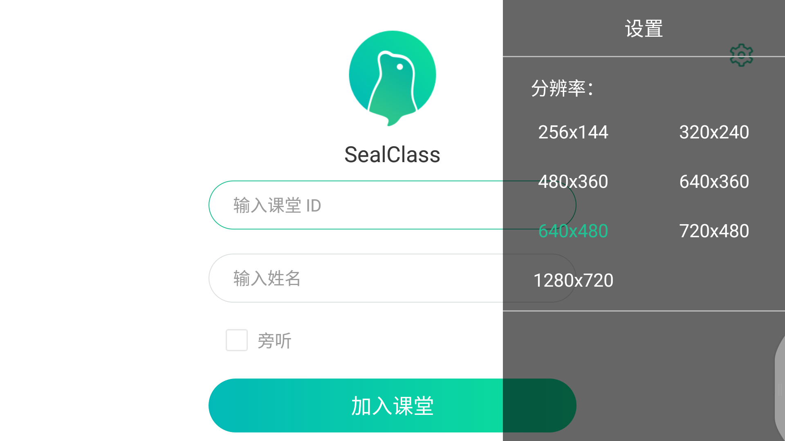
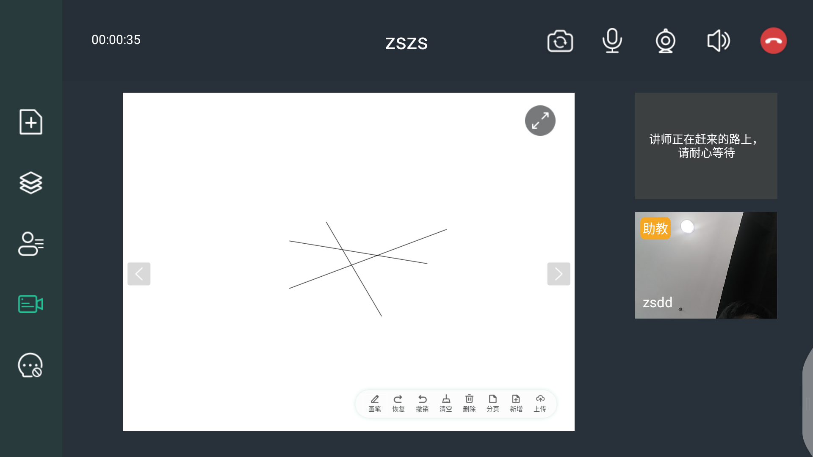
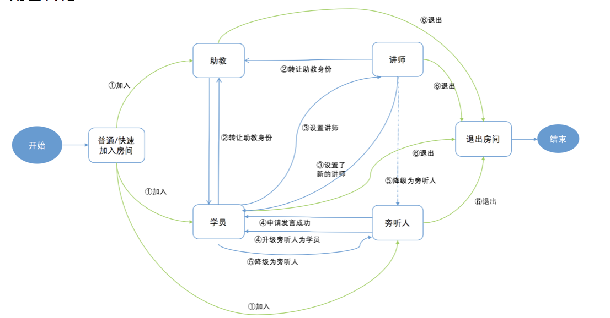
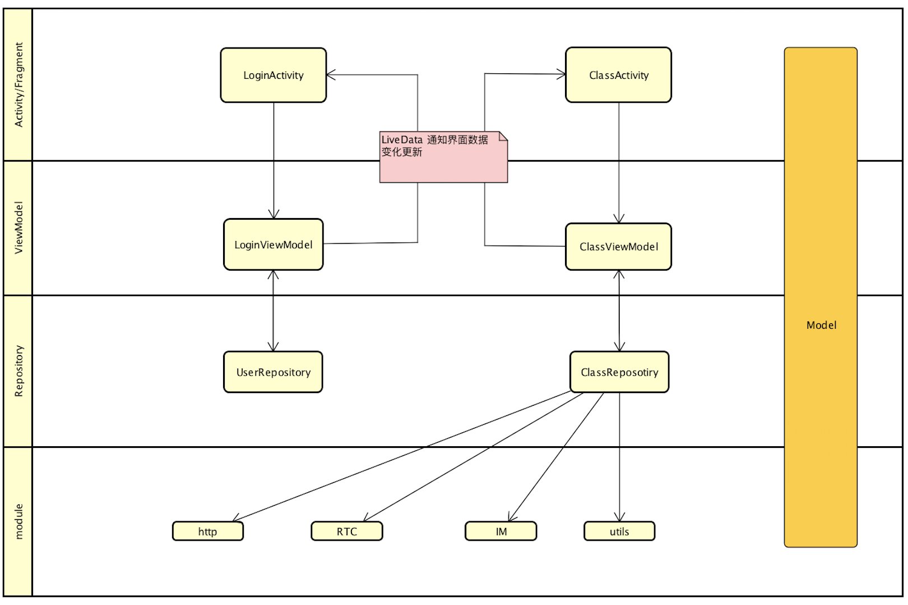
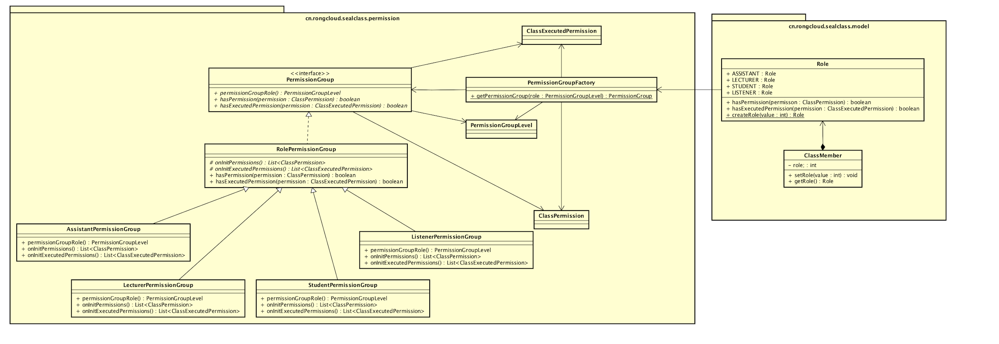
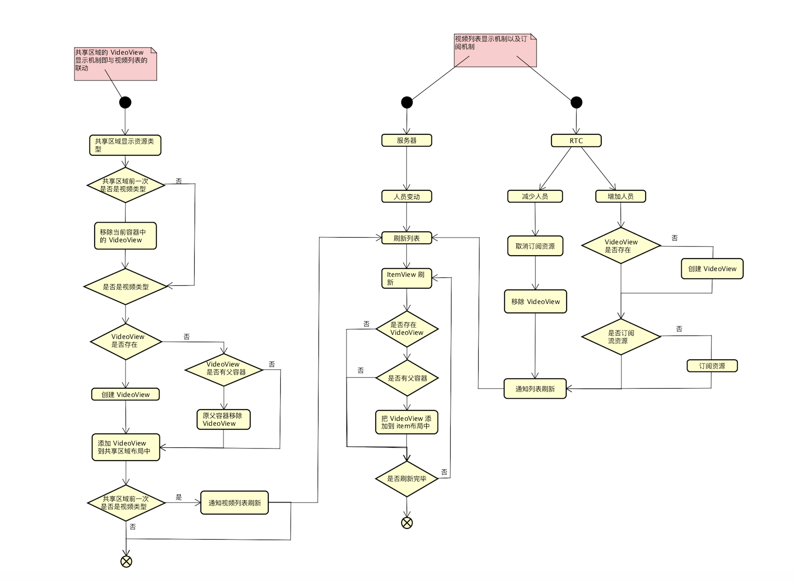

## SealClass-Android

本文档介绍了 SealClass 的整体框架设计和核心流程，为开发者了解 SealClass 的主要功能提供指导性说明。体验 [SealClass](https://www.rongcloud.cn/solution/edu)。

## 简介

SealClass，是以音视频为基础，满足参与者在线教学、互动需要的教育协作型产品。
提供了视频、桌面共享、白板、聊天、课堂控制等等功能. 

## 产品介绍

SealClass 为一款在线课堂软件. 页面主要分为登录页面和主界面.

### 登录界面

登录界面主要是登录功能和设置音视频分辨率的设置功能. 
具体代码可查看 LoginActivity 和 UserVideoModel.

### 主界面

主界面是登录成功之后的课堂界面 (ClassActivity). 

课堂区域主要分为一下几个部分 (以及对应的界面):

* **左侧导航栏 (ClassScreenControlFragment)** 控制切换功能布局
* **顶部控制栏 (ClassTopOperateControlFragment)** 控制用户自己音视频操作和退出房间.
* **资源列表(ClassResourceFragment)** 切换当前的资源在共享区的显示. 此模块只有助教和讲师可使用. 
* **共享画布区域(ClassShareScreenFragment)** 显示共享画面. 显示类型为白板, 视频, 共享桌面.
* **消息区(ClassConversationFragment)** IM 聊天功能.
* **视频区(ClassVideoListFragment)** 显示当前房间中音视频的用户视频列表.
* **在线成员列表(ClassMemberListFragment)** 显示当前在线成员列表. 助教可对其他成员进行操作.

### 角色

SealClass 中有四种用户角色:

* **助教** 持在线课堂秩序的角色，可对其他成员进行课堂控制操作，如关闭手机上的麦克风，助教可转让助教角色给讲师或学员.
* **讲师** 在通话中讲话的主要角色，所有成员看到的共享画布区域都展示此人的视频画面，只有助教才能设置某位学员为讲师.
* **学员** 所有参加通话的人中除讲师、助教外，其它有视频画面能说话的角色.
* **旁听者** 若用户选择以此角色进入课堂，则用户可以听见、看见当前课堂除自己外其它人的声音和视频，但该用户的声音和图像不会被传输到课堂中.

### 产品流程图

## 设计介绍

### 框架介绍

SealClass 使用 MVVM 框架结构. 

使用 Android 官方的 architecture 框架组件中的 

* ViewModel
* LiveData
* Lifecycle

由于 Databinding 出问题不好定位原因. 所以舍弃了使用 Databinding.

基本结构如下:

* **Activity/ Fragment**  为 View 层. 主要控制 View 层的显示逻辑.
* **VideModel**  主要为 View 层提供数据更新以及逻辑方法.
* **Repository** 主要提供数据, 包括数据库查询和网络请求等. 
* **Module** 三方库和基础工具类. 提供基础功能操作.
	* **IM 功能**. 使用融云 IMkit 库. 具体可查看 [融云 RTC ](https://www.rongcloud.cn/downloads)
	* **音视频功能**. 使用融云 RTC 库. 具体可查看 [融云 IMKit ](https://www.rongcloud.cn/downloads/rtc)
	* **网络请求**. 使用 retrofit 库.

### 权限设计

SealClass 中目前有四种角色(助教, 讲师, 学员, 旁听者), 不同的角色有不同的权限. 用户可改变角色身份.

考虑以后有扩展的需求, 我们采用了策略模式来设计权限， 制定权限组并与角色绑定. 让成员通过设置不同的角色而获取对应的权限组.

权限类图设计如下:

**权限类型**

* ClassPermisson 拥有的可执行的权限. 如 语音通话, 操控课堂的权限等.
* ClassExcutedPermission 被执行权限. 即允许别人对当前用户执行哪些操作. 例如关闭摄像头, 降级等等.

**权限组**

权限组设计的好处是独立并可重复使用, 可任意组合添加权限组. 权限组可不考虑用户角色.

如果需要增加权限组, 可继承 RolePermissionGroup 类, 实现其中的 hasPermission() 和 hasExcutedPermission() 方法, 设置返回当前权限组所拥有的权限即可.

**Role**

权限组无法直接去体现角色身份.为了体现出角色身份, 所以增加了 Role 枚举类, 然后通过 Role 的角色和对应的权限组进行绑定,这样就可通过角色查询其拥有哪些权限.

**ClassMember** 

成员类. ClassMember 对象持有不同的 Role 变为不同的角色,并拥有对应的权限组. 设置角色身份可通过 setRole() 方法, 不需要重新创建对象.

### 视频列表刷新流程
由于设计需求, 音视频绑定的 VideView 会根据情况添加到不同的父布局容器中并刷新界面. 下面是音视频的订阅流程、视频列表以及共享区域之间的界面互动流程逻辑.

## 运行环境
* Android Studio 3.2 以上版本
SealMic 适配了 Android X，所以需要 使用 3.2 以上版本的 Android Studio 才能保证可以正常编译和使用。代码中有地方可能报红色错误, 不影响编译运行.
* 推荐使用真实 Android 设备
部分模拟器会存在功能缺失或运行环境不稳定等情况影响使用体验。
* SealClass Server 源码可以参考 [这里](https://github.com/rongcloud/sealclass-server)

## 使用的融云产品
* **即时通讯 IMKit SDK**  可详细查看 [IMKitSDK 开发指南](https://www.rongcloud.cn/docs/android.html)
* **音视频 RTC SDK** 可详细查看 [RTC SDK 开发指南](https://www.rongcloud.cn/docs/android_rtclib.html)

## 联系我们
* 如果发现了示例代码的 bug, 欢迎提交 [issue]()
* 如果有售前咨询问题, 可以拨打 13161856839 进行咨询

